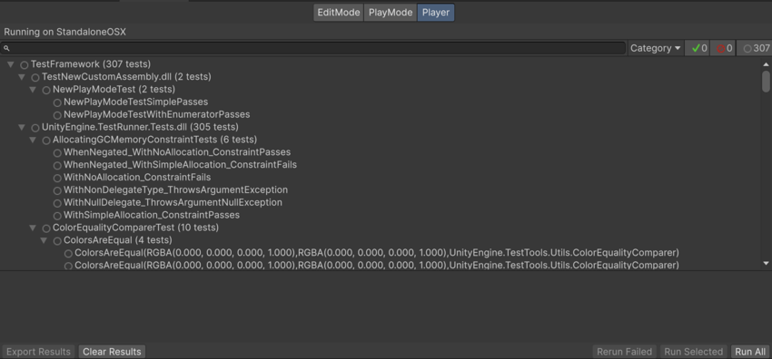
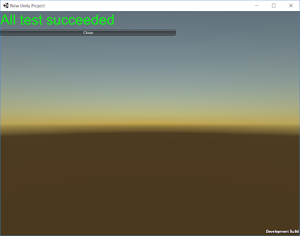
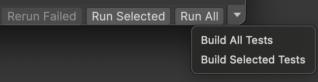
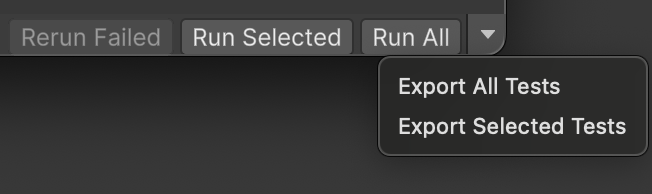

# 在 Player 中运行 Play Mode 测试

> 原文：[Run Play mode tests in a Player](https://docs.unity3d.com/6000.7/Documentation/Manual/test-framework/workflow-run-playmode-test-standalone.html)

如果以运行 [Editor 测试](https://docs.unity3d.com/6000.7/Documentation/Manual/test-framework/workflow-run-test.html) 的相同方式运行 Play Mode 测试，测试会在 Unity Editor 内运行。也可以在特定平台上运行 Play Mode 测试。选择 **Player** Tab，可以在当前激活的目标平台上构建并运行测试。

当前平台显示在 **Test Runner** 窗口顶部。例如，上图搜索栏上方的栏显示 **Running in StandaloneOSX**，因为当前平台是 MacOS。目标平台始终是 **Build Profiles** 中选择的激活平台配置（菜单：**File > Build Profiles**）。

测试完成后，构建出的 Player 会显示测试结果：

应用会将测试结果报告回 Editor UI，然后显示已执行的测试并关闭。某些平台不支持使用 Application.Quit 关闭 Player 应用，因此在报告测试结果后应用仍会继续运行。

要确保目标平台上的 Player 能将测试结果传回运行测试的 Editor，二者必须位于同一网络。如果 Unity 无法建立连接，你仍然可以在运行中的应用中看到测试成功。在带参数的平台上以这种状态运行测试时，不会提供 XML 测试结果。

## 构建带测试的 Player

可以使用 **Run All** 按钮旁边的下拉选择器，在不运行测试的情况下构建包含全部测试或选定测试子集的 Player。

在某些情况下，可用选项会有所不同。如果选定平台是 Android 或 iOS，并且在 Build Profiles 中启用了 **Export Project**，可用选项会变为 **Export All Tests** 和 **Export Selected Tests**。

## 其他资源

- [[01-修改Player构建参考]]
- [[../../05-Unity Test Framework学习材料/01-Unity Test Framework通用简介/07-Player中的PlayMode测试]]

---

## 文档导航

- 上一页：[[../03-从代码运行测试/03-获取测试结果]]
- 目录：[[00-在Player中运行Play Mode测试]]
- 下一页：[[01-修改Player构建参考]]
