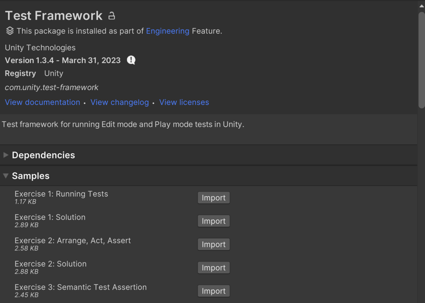

# Unity Test Framework 通用简介

> 原文：[General introduction to Unity Test Framework](https://docs.unity3d.com/6000.7/Documentation/Manual/test-framework/course/test-framework-general-introduction.html)

欢迎学习 Unity Test Framework 通用简介课程。

本课程由不同练习组成，通过实践示例帮助你学习 Unity Test Framework 的基础概念。每个练习都有一个“学习目标”部分，用于说明你将学会的技能。练习按主题分组，难度各不相同。

完成练习后，你可以将自己的解答与提供的解答进行对照。请注意，许多练习都有多种可行的解法。

## 导入示例

每个练习的项目文件及其配套解决方案，都作为 Unity Test Framework package 的 samples 提供。要将练习或解决方案导入 Unity Editor，请执行以下操作：

1. 打开 **Window > Package Manager**，并在 package list view 中选择 Unity Test Framework。
2. 在 package details view 中找到 **Samples** 部分。
3. 找到要导入的练习或解决方案，并点击导入按钮。

*Package Manager 窗口，其中展开了可导入的 package samples 列表。*

> **注意：** 你可以同时导入一个练习及其解决方案，也可以同时导入多个练习；但是，由于多个练习可能使用相同的命名模式，这很可能导致编译错误，从而阻止你运行测试或构建项目。推荐一次只导入并完成一个练习。如果为了参考而导入了其他练习或解决方案，请在运行主要练习之前将它们删除。

## 课程大纲

| 主题 | 说明 |
| --- | --- |
| [[01-在Unity项目中运行测试]] | 设置一个包含测试程序集和测试的简单 Unity 项目，并从 Test Runner 窗口运行测试。 |
| [[02-Arrange Act Assert]] | 使用单元测试的核心原则 AAA（Arrange、Act、Assert）组织测试。 |
| [[17-语义测试断言]] | 使用 `Assert.That` 测试条件是否成立。 |
| [[03-自定义比较]] | 使用 Unity Test Framework 的自定义 equality comparer 检查 Unity 类型的值是否相等。 |
| [[04-断言和预期日志]] | 测试和验证会向 Console log 写入内容的代码。 |
| [[05-SetUp和TearDown]] | 使用 NUnit 的 `[SetUp]` 和 `[TearDown]` 减少测试中的代码重复。 |
| [[06-PlayMode测试]] | 创建并运行 Play Mode 测试。 |
| [[07-Player中的PlayMode测试]] | 在 standalone platform Player 中运行 Play Mode 测试。 |
| [[08-使用UnityTest属性]] | 使用 `[UnityTest]` 编写可跨多个 frame 运行的测试。 |
| [[09-长时间运行的测试]] | 编写可以指示 Editor 等待指定时间的长时间运行测试。 |
| [[10-基于Scene的测试]] | 测试存储在 Scene 中的内容。 |
| [[11-构建时设置和清理]] | 在 Player build phase 前后执行工作。 |
| [[12-Domain Reload]] | 从测试中调用并等待 Domain Reload。 |
| [[13-保留测试状态]] | 使用 serialization 让测试中的数据在 Domain Reload 后继续存在。 |
| [[14-测试用例]] | 在 Unity 测试中使用 NUnit 的 `[TestCase]` 属性。 |
| [[15-自定义属性]] | 实现可改变测试执行方式的自定义 NUnit 属性。 |
| [[16-以代码方式运行测试]] | 使用 `TestRunnerAPI` 从代码运行测试。 |

## 其他资源

- [[../02-测试Lost Crypt/00-测试Lost Crypt]]

---

## 文档导航

- 上一页：[[../00-Unity Test Framework学习材料]]
- 目录：[[00-Unity Test Framework通用简介]]
- 下一页：[[01-在Unity项目中运行测试]]
