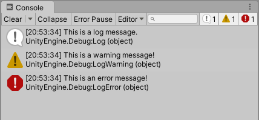
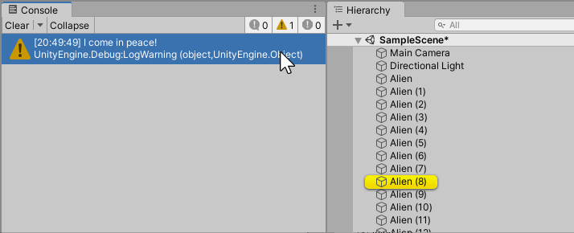
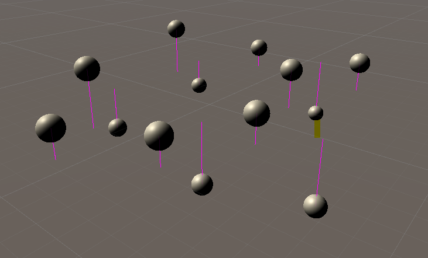

# Debug 类

> 原文：[The Debug class](https://docs.unity3d.com/6000.7/Documentation/Manual/class-Debug.html)

`Debug` 类允许你在 Unity Editor 中可视化信息，帮助你在项目运行时了解或调查项目中正在发生的事情。例如，你可以使用它向 Console 窗口打印消息、在 Scene 视图和 Game 视图中绘制可视化线条，以及通过脚本暂停 Editor 中的 Play mode。

本页面概述 `Debug` 类及其在脚本编写中的常见用途。有关 `Debug` 类所有成员的完整参考，请参阅 [Debug 脚本参考](https://docs.unity3d.com/6000.7/Documentation/ScriptReference/Debug.html)。

## 记录错误、警告和消息

Unity 有时会将错误、警告和消息记录到 Console 窗口。`Debug` 类允许你在自己的代码中执行相同操作，如下例所示：

```csharp
Debug.Log("This is a log message.");
Debug.LogWarning("This is a warning message!");
Debug.LogError("This is an error message!");
```

这三种类型（错误、警告和消息）在 Console 窗口中分别使用不同的图标。



写入 Console 窗口的所有内容（无论由 Unity 还是由你自己的代码写入）也会写入[[04-日志文件参考|日志文件]]。

如果在 Console 中启用了 **Error Pause**，通过 `Debug` 类写入 Console 的任何错误都会使 Play mode 暂停。

你还可以为这些日志方法提供第二个可选参数，表示消息与某个特定的 GameObject 相关联，如下例所示：

```csharp
using UnityEngine;

public class DebugExample : MonoBehaviour
{    void Start()
    {
        Debug.LogWarning("I come in peace!", this.gameObject);
    }
}
```

这样做的好处是：当你在 Console 中单击该消息时，与消息关联的 GameObject 会在 Hierarchy 中高亮显示，从而帮助你确定该消息涉及哪个 GameObject。在下图中，选择 `I come in peace!` 警告消息会高亮显示 **Alien (8)** GameObject。



## 使用 Debug 类

`Debug` 类提供了两个用于在 Scene 视图和 Game 视图中绘制线条的方法：[`DrawLine`](https://docs.unity3d.com/6000.7/Documentation/ScriptReference/Debug.DrawLine.html) 和 [`DrawRay`](https://docs.unity3d.com/6000.7/Documentation/ScriptReference/Debug.DrawRay.html)。

在此示例中，Scene 中的每个 Sphere GameObject 都添加了一个脚本。该脚本使用 `Debug.DrawLine` 指示 Sphere 与 Y 等于零的平面之间的垂直距离。请注意，本例中的最后一个参数表示该线条在 Editor 中保持可见的秒数。

```csharp
using UnityEngine;

public class DebugLineExample : MonoBehaviour
{
    // Start is called before the first frame update
    void Start()
    {
        float height = transform.position.y;
        Debug.DrawLine(transform.position, transform.position - Vector3.up * height, Color.magenta, 4);
    }
}
```

结果在 Scene 视图中如下所示：



### 从非 Development Build 中排除 Debug 代码

[UnityEngine.Debug](https://docs.unity3d.com/6000.7/Documentation/ScriptReference/Debug.html) 日志 API 不会从[发布构建](https://docs.unity3d.com/6000.7/Documentation/Manual/building-introduction.html)中剥离；如果调用这些 API，它们仍会写入日志文件。你可以使用 `#if` 指令或条件属性，使 `Debug` 调用的编译取决于一个只在 Development Build 中定义的 scripting symbol，从而阻止这些调用出现在发布构建中。

下面的示例使用带有名为 `ENABLE_LOGS` 的 scripting symbol 的条件属性，该 symbol 只在 Development Build 中定义：

```csharp
public static class Logger {

    [Conditional("ENABLE_LOGS")]
    public static void Debug(string logMsg) {
        UnityEngine.Debug.Log(logMsg);
    }
}
```

有关更多信息，请参阅 [Unity 中的条件编译](https://docs.unity3d.com/6000.7/Documentation/Manual/platform-dependent-compilation.html)。

## 其他资源

- [Console 窗口](https://docs.unity3d.com/6000.7/Documentation/Manual/Console.html)
- [[04-日志文件参考]]


---

## 文档导航

- 上一页：[[02-调试故障排查]]
- 目录：[[00-调试和诊断]]
- 下一页：[[04-日志文件参考]]
