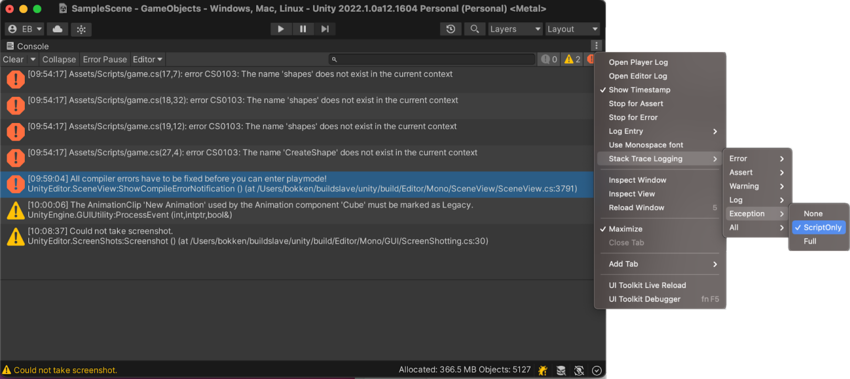

# Stack Trace 日志

> 原文：[Stack trace logging](https://docs.unity3d.com/6000.7/Documentation/Manual/stack-trace.html)

Unity Console 消息和日志文件可以包含详细的 Stack Trace 信息。Console 还会链接到生成消息的代码行。当你想要确定导致日志条目出现的代码行、方法或函数调用顺序时，这非常有用。

> **提示：** 检查代码的另一种方式是将 [debugger](https://docs.unity3d.com/6000.7/Documentation/Manual/managed-code-debugging.html) 附加到 Editor 或构建的 Player。

## Managed code 和 unmanaged code 的 Stack Trace

Unity 可以为 managed code 和 unmanaged code 提供 Stack Trace 信息：

- **Managed code：** 在 Unity 中运行的 managed DLL 或 C# 脚本。这些代码可以是随 Unity 一起发布的脚本、你编写的自定义脚本、Asset Store plug-in 中包含的第三方脚本，或引擎中运行的任何其他 C# 脚本。
- **Unmanaged code：** 原生 Unity 引擎代码，或直接在你的计算机上或目标构建平台上运行的 native plug-in 代码。Unmanaged code 通常由 C 或 C++ 代码编译而成。只有拥有 native binary 的原始源代码时，才能访问其中的代码。通常只有在需要确定错误是由你的代码还是引擎代码导致，以及需要确定具体是引擎代码的哪一部分导致时，才会使用 unmanaged code 的 Stack Trace。

Unity 提供三种 Stack Trace 选项：

- **None：** Unity 不输出 Stack Trace 信息。
- **ScriptOnly：** Unity 仅输出 managed code 的 Stack Trace 信息。这是默认选项。
- **Full：** Unity 同时输出 managed code 和 unmanaged code 的 Stack Trace 信息。

你可以针对每一种[日志消息类型](https://docs.unity3d.com/6000.7/Documentation/ScriptReference/LogType.html)分别设置 Stack Trace 选项：Error、Assert、Warning、Log 和 Exception。

## Stack Trace 的资源需求

解析 Stack Trace，尤其是完整 Stack Trace，是一项资源密集型操作。关于 Stack Trace 的一些最佳实践包括：

- 仅将 Stack Trace 用于调试。不要在启用 Stack Trace 的情况下将应用程序部署给用户。
- 限制显示 Stack Trace 的消息类型。例如，可以考虑只对 Exception 和 Warning 使用 Stack Trace。

## 设置 Stack Trace 类型

你可以通过以下方式配置 Stack Trace 选项：

- 从 [Console 窗口](https://docs.unity3d.com/6000.7/Documentation/Manual/Console.html)菜单设置：

  - 如果要为所有日志消息类型选择 Stack Trace 选项，请导航到 **Stack Trace Logging** > **All**，然后为所有日志消息类型选择 Stack Trace 选项。
  - 如果要为一种日志消息选择 Stack Trace 选项，请导航到 **Stack Trace Logging** > **[MESSAGE TYPE]**，然后为该日志消息类型选择 Stack Trace 选项。

- 从 [Player Settings 窗口](https://docs.unity3d.com/6000.7/Documentation/Manual/class-PlayerSettings.html)设置：

  - 转到 **Edit** > **Project Settings** > **Player** > **Other Settings**。
  - 在 **Stack Trace** 下，使用复选框为不同的日志消息类型设置 Stack Trace 选项。

- 在代码中使用 [`Application.SetStackTraceLogType`](https://docs.unity3d.com/6000.7/Documentation/ScriptReference/Application.SetStackTraceLogType.html) 方法。

> **注意：** 在 Editor 中，更改 Stack Trace 选项会立即生效；但要使更改在构建的 Player 中生效，必须[重新构建应用程序](https://docs.unity3d.com/6000.7/Documentation/Manual/building-and-publishing.html)。

## 从 Stack Trace 输出打开源文件

消息的完整文本包含指向代码文件中特定代码行的链接。单击任意链接，即可在 IDE 中打开对应文件的对应代码行。

## 查找构建应用程序的输出日志文件

构建的应用程序不会输出到 Console。要查看 Stack Trace，请[[04-日志文件参考|使用应用程序的日志文件]]。

## 其他资源

- [Console 窗口](https://docs.unity3d.com/6000.7/Documentation/Manual/Console.html)
- [[04-日志文件参考]]

---

## 文档导航

- 上一页：[[04-日志文件参考]]
- 目录：[[00-调试和诊断]]
- 下一页：[[06-Roslyn分析器和源生成器/00-Roslyn分析器和源生成器]]
